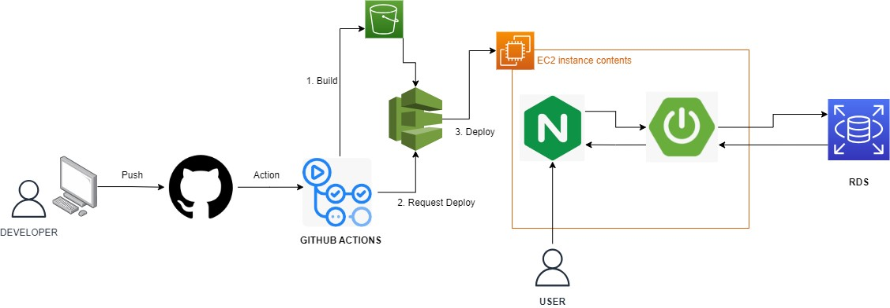
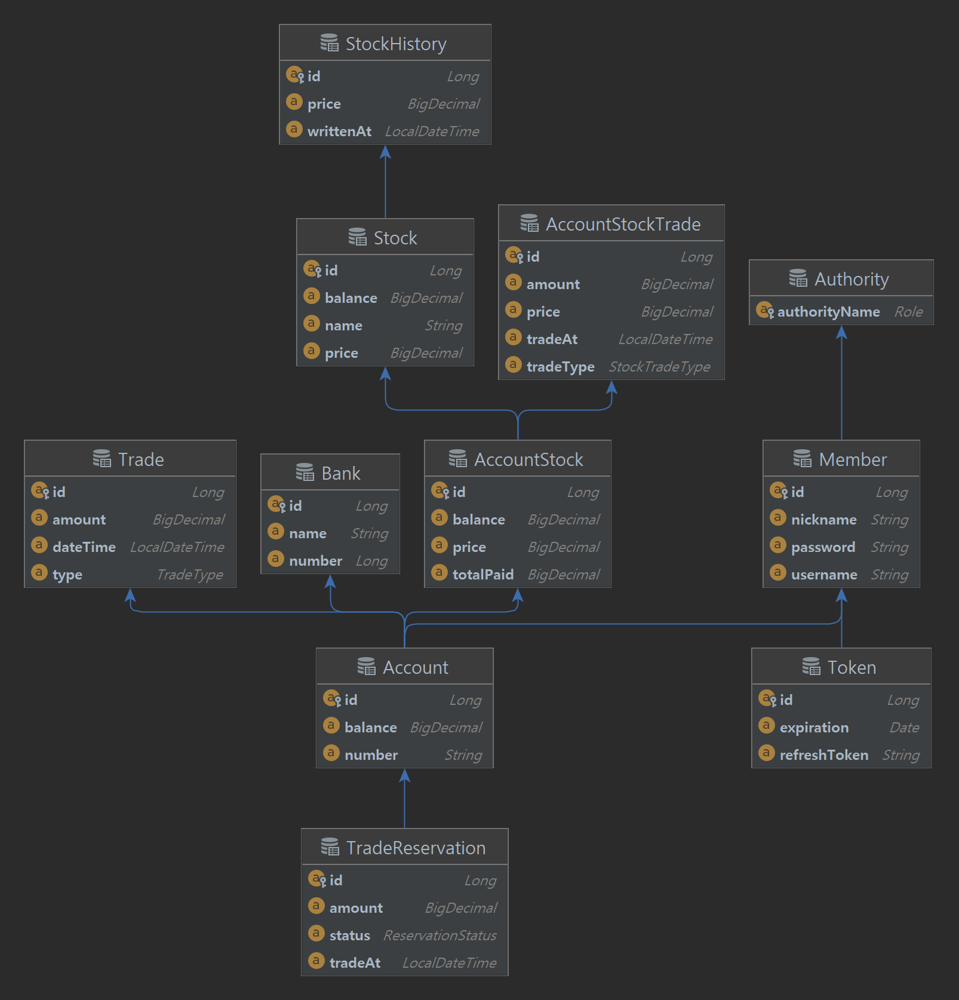
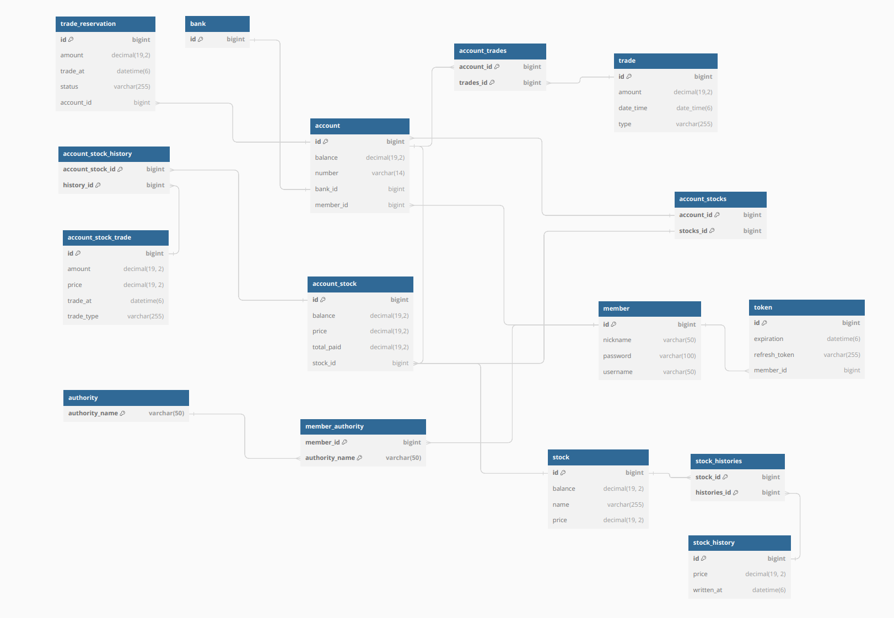

# 주식 서비스

## 프로젝트 기간
* 23.06.26 ~ 23.07.23
  
## 개발 환경
- 'Java 11'
- **IDE** : Spring boot 2.7.13
- **Database** : MariaDB

## 시스템 아키텍처
- Github Action을 통해 CI후 빌드파일 S3에 저장 $rarr; Codedeploy에 CD 요청해 S3의 빌드파일을 EC2에 배포합니다.
- EC2는 NginX를 통해 가장 최근의 배포되어 실행중인 Application 서비스로 리버스 프록시됩니다.
- Application 서비스는 Api 서비스와 Batch 서비스가 같이 실행됩니다.
- DB는 MariaDB RDS로 EC2서비스에서 연결되어 있습니다.

## ERD

## DB Schema

